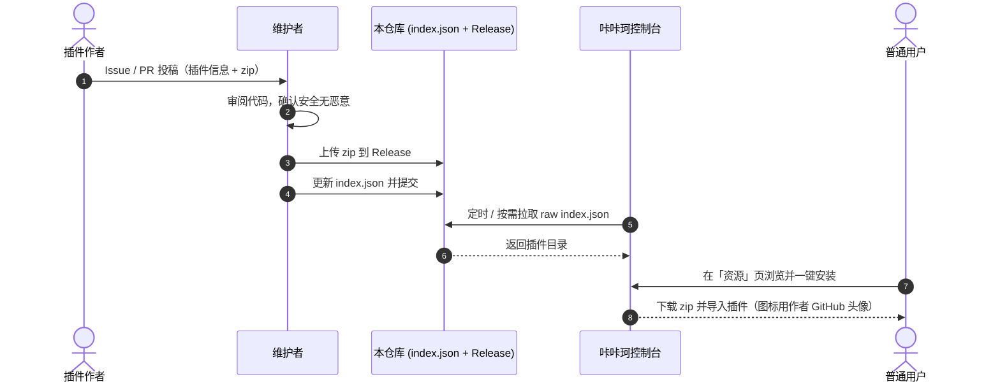

# 咔咔珂插件商店（kakake-plugin-main）

这是 **咔咔珂（kakake）** 框架「资源 / 插件商店」页面的**数据源仓库**。

咔咔珂后端会读取本仓库根目录的 [`index.json`](./index.json)，把里面收录的插件展示在控制台的「资源」界面，用户点击即可一键安装。

> 本仓库只是一份**插件目录（清单）+ 文件托管**，不是插件运行框架本体。插件本体是每个 zip 包里的代码，由咔咔珂在用户本机加载运行。

---

## 目录

- [这个仓库是干什么的](#这个仓库是干什么的)
- [整体运作原理](#整体运作原理)
- [仓库结构](#仓库结构)
- [我是插件作者，怎么投稿](#我是插件作者怎么投稿)
- [我是维护者，怎么审核收录](#我是维护者怎么审核收录)
- [插件更新怎么办](#插件更新怎么办)
- [安全与免责](#安全与免责)
- [相关文档](#相关文档)

---

## 这个仓库是干什么的

| 角色 | 在这里做什么 |
|------|----------------|
| **插件作者** | 通过 Issue 或 Pull Request 投稿插件，等维护者审核收录 |
| **维护者（仓库主人）** | 审核投稿、把 zip 传到 Release、更新 `index.json` |
| **普通用户** | 什么都不用来这里做；直接在咔咔珂控制台的「资源」页浏览和安装即可 |

---

## 整体运作原理




1. **作者投稿** → 提交插件信息（名字、简介、下载 zip 等）。
2. **维护者审核** → 看代码、把 zip 锁进本仓库 Release。
3. **写入 `index.json`** → 商店的「菜单」更新。
4. **咔咔珂读取** → 后端 `fetch` 本仓库 `index.json` 的原始直链。
5. **用户安装** → 控制台展示，点击下载 zip 并导入。

咔咔珂读取的原始直链形如：

```
https://raw.githubusercontent.com/tc-404/kakake-plugin-main/main/index.json
```

> ⚠️ 境内直连 `raw.githubusercontent.com` / `github.com` 可能不稳定，最终用户下载插件也许会失败。建议在后端为下载与读取加国内镜像/代理兜底。

---

## 仓库结构

```text
kakake-plugin-main/
├── index.json                        # ★ 插件目录（商店数据源，后端读这个）
├── README.md                         # 本文件：总览
├── CONTRIBUTING.md                   # 投稿指南（作者必读）
├── docs/
│   ├── index-format.md               # index.json 字段规范（逐字段说明）
│   └── review-guide.md               # 维护者审核指南
└── .github/
    ├── ISSUE_TEMPLATE/
    │   ├── plugin-submit.md           # 「新插件投稿」Issue 模板
    │   └── plugin-update.md           # 「插件更新」Issue 模板
    └── PULL_REQUEST_TEMPLATE.md       # PR 模板
```

- `index.json` 是唯一被程序读取的文件，**结构必须严格合法**（改动前请对照 [`docs/index-format.md`](./docs/index-format.md)）。
- 插件的 **zip 文件不放在仓库目录里**，一律放到 **Releases** 的附件（见投稿指南）。
- **不需要上传图标 / 封面**：插件在商店里的图标由咔咔珂后端自动使用作者的 GitHub 头像。

---

## 我是插件作者，怎么投稿

请完整阅读 **[投稿指南 CONTRIBUTING.md](./CONTRIBUTING.md)**。两种方式任选：

- **新手 / 图省事** → 用 **Issue 投稿**（不用会 Git，填个表单即可）。
- **熟悉 Git** → **Fork + Pull Request**，自己改 `index.json`，维护者只需审核合并。

无论哪种方式，都要遵守一条硬规则：

> **插件 zip 必须能被上传到本商店仓库 Release；不接受指向作者自有服务器/图床或作者自己项目仓库的外链。** 图标不用提供——自动使用作者的 GitHub 头像。

---

## 我是维护者，怎么审核收录

请阅读 **[审核指南 docs/review-guide.md](./docs/review-guide.md)**。核心步骤：

1. 下载投稿者的 zip，**逐行看真实代码**，确认无恶意、无与描述严重不符。
2. 在本商店仓库 **新建 Release**，把 zip 作为附件上传（锁住文件来源）。
3. 复制 Release 附件的直链，填进 `index.json` 的 `download`；`name` 填投稿者的 GitHub 用户名（图标即用其头像），`type` 选 `野生/官方/微信/其他`。星数、更新时间由后端调 API 自动获取。
4. 提交 `index.json` 改动（PR 投稿则直接改 PR 后合并）。

---

## 插件更新怎么办

插件不是自动跟版的。作者发布新版本时，需要**再投一次稿（更新）**：

1. 作者用「插件更新」Issue 模板 / 新 PR 提交新版本信息与新 zip。
2. 维护者**同样要审新版本代码**（更新往往是恶意代码混入的时机，切勿因是熟人就放松）。
3. 维护者新建一个**新版本的 Release**（如 `weather-v1.1.0`，不要覆盖旧文件）。
4. 更新 `index.json` 里该插件的 `version` / `update_notes` / `download` 等字段。

详见 [审核指南](./docs/review-guide.md) 与 [投稿指南](./CONTRIBUTING.md)。

---

## 安全与免责

- 插件是可执行代码，**收录 ≠ 官方背书**；启用即代表用户自愿使用该插件。
- 维护者审核尽力而为，但无法保证第三方插件绝对安全，用户需自行甄别。
- 严禁投稿含恶意行为、窃取凭据、违法违规、侵犯版权或冒充他人的插件。
- 请勿在投稿内容中包含任何密钥、Token 或隐私信息。

---

## 相关文档

- [投稿指南](./CONTRIBUTING.md)
- [index.json 字段规范](./docs/index-format.md)
- [维护者审核指南](./docs/review-guide.md)

**咔咔珂插件商店** — 作者投稿，维护审核，用户一键安装。
