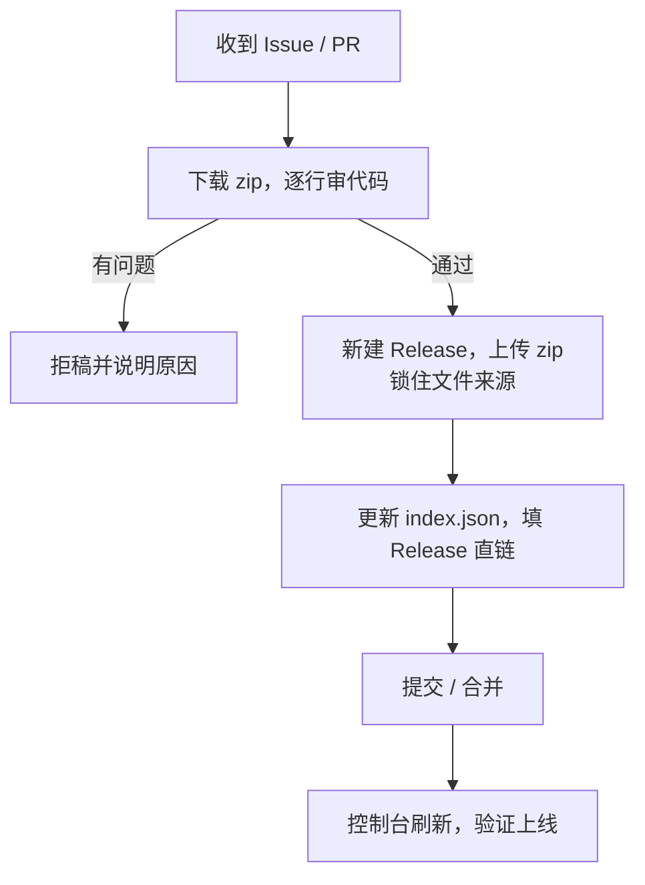

# 维护者审核指南

本指南面向**仓库维护者（商店主人）**，说明收到投稿后怎么审、怎么把插件正式收录进商店。

> 核心原则：**文字随作者写，代码和文件必须经维护者之手、存于本仓库。** 维护者审的是代码安全与文件来源，不是文案措辞。

---

## 目录

- [审核总流程](#审核总流程)
- [第一步：代码安全审阅](#第一步代码安全审阅)
- [第二步：把文件锁进 Release](#第二步把文件锁进-release)
- [第三步：更新 index.json](#第三步更新-indexjson)
- [第四步：验证上线](#第四步验证上线)
- [审核插件更新](#审核插件更新)
- [拒稿与下架](#拒稿与下架)
- [安全红线清单](#安全红线清单)

---

## 审核总流程




---

## 第一步：代码安全审阅

**这是最重要的一步，别跳过。** 插件是能在用户本机执行的代码。

1. 从 Issue 附件 / PR 描述下载投稿者的 zip，解压。
2. 确认包结构合法：有可用的 `plugin.json` / `package.json`、入口文件存在。
3. **逐行读源码**，重点看：
   - 有没有读取 / 上传用户凭据、聊天记录、`data/` 下的密钥；
   - 有没有 `eval` / `Function` 动态执行、从远程 URL 下载代码再运行；
   - 有没有连接可疑外部地址、发送用户数据到第三方；
   - 有没有删除 / 破坏文件、越权访问系统；
   - 功能是否与简介大体一致（不能挂羊头卖狗肉）。
4. 混淆 / 加壳 / 无法阅读的代码 → 直接拒。

> 若插件较大或看不懂，宁可拒稿或要求作者提供可读源码，也不要"图省事直接过"。

---

## 第二步：把 zip 锁进 Release

审核通过后，**把插件 zip 转存到本仓库 Release**，从此下载来源在维护者手里，作者无法事后偷换。**不需要处理封面/图标——商店图标自动使用作者的 GitHub 头像。**

1. 仓库右侧 **Releases → Draft a new release**（或 Create a new release）。
2. **Tag** 用版本化命名，建议：`<插件英文名>-v<版本>`，例如 `weather-v1.0.0`。
3. **Release title**：`天气插件 1.0.0`（写清可读名）。
4. **Attach binaries**：把审核通过的 **zip** 拖进去上传。
5. **Publish release**。
6. 发布后，右键 zip 附件 **复制链接**（Copy link address），得到形如：
   ```
   https://github.com/tc-404/kakake-plugin-main/releases/download/weather-v1.0.0/weather-plugin-1.0.0.zip
   ```
7. （可选）算一下 zip 的 SHA-256 填进 `sha256` 字段，供下载完整性校验：
   - PowerShell：`(Get-FileHash 插件.zip -Algorithm SHA256).Hash.ToLower()`
   - Linux/macOS：`sha256sum 插件.zip`

> **不要用作者的原始外链、也不要用作者自己项目仓库的链接**当下载地址；更新时也**不要**复用旧 Release 覆盖文件——每个版本一个独立 Release / 独立文件名。

---

## 第三步：更新 index.json

编辑仓库根目录 `index.json`（字段含义见 [`index-format.md`](./index-format.md)）：

**Issue 投稿**：由维护者手动在 `plugins` 数组追加一条：`title`（插件展示名）、`plugin_id`（核对插件包 `plugin.json` 的 `name`，用于已安装/更新判断）、`download`（上一步的 Release 直链）、`sha256`（上一步算出的校验值，可选）、`type`（`野生/官方/微信/其他` 选一个）、`name`（投稿 Issue 提交者的 GitHub 用户名，页面上就能看到，真实防冒充）、`min_kakake`（可选，最低咔咔珂版本）。星数、更新时间、图标都不用填——后端自动处理。

**PR 投稿**：作者已改好 `index.json`，维护者在 **Files changed** 审查，把 `download` 替换 / 确认为新建 Release 的直链，核对 `name` 与 PR 提交者一致、`plugin_id` 与插件包 `name` 一致、`type` 填得对，然后 **Merge**。

务必确认：

- [ ] `title` 已填且不与已有插件重名（展示名）；
- [ ] `plugin_id` 与插件 `plugin.json` 的 `name` 一致；
- [ ] `type` 是 `野生/官方/微信/其他` 之一；
- [ ] `name` 填的是真实提交者的 GitHub 用户名；
- [ ] `download` 是**本商店仓库 Release** 直链（不是作者自有外链、不是作者项目仓库地址）；
- [ ] JSON 语法合法（贴到 JSON 校验器确认）。

---

## 第四步：验证上线

1. 提交 / 合并 `index.json` 后，等 GitHub raw 缓存刷新（通常几十秒到几分钟）。
2. 咔咔珂控制台「资源」页点**刷新**（后端列表缓存 TTL 约 1 分钟，或带 `?refresh=1`）。
3. 确认新插件出现、图标（作者 GitHub 头像）可显示、点安装能下载并成功导入。
4. 有问题回到对应步骤修正。

---

## 审核插件更新

更新是**恶意代码最常见的混入时机**，务必与首次一样严格：

1. 收到「插件更新」投稿，**重新完整审阅新版本代码**（不要因是老熟人而放松）。
2. 新建**新版本 Release**（如 `weather-v1.1.0`），上传新 zip，**保留旧 Release**。
3. 更新 `index.json` 里该插件条目：
   - `version` → 新版本；
   - `update_notes` → 本次更新说明（可选）；
   - `download` → 新 Release 的 zip 直链。
   > 更新时间不用改：后端按新 Release 的发布时间自动显示。
4. 提交并按第四步验证。

> 保留旧 Release 便于回退与追溯；`index.json` 只需指向最新版本。

---

## 拒稿与下架

- **拒稿**：在 Issue / PR 下说明具体原因（对照[安全红线](#安全红线清单)），关闭（Close）即可。作者可修改后重投。
- **下架某插件**：从 `index.json` 的 `plugins` 中删除该条目并提交即可（Git 历史仍可追溯，需要时再恢复）。
- **紧急撤下**：若已合并的插件被发现有问题，可用 GitHub 的 **Revert** 一键回退该次提交，或直接改 `index.json` 移除条目。

---

## 安全红线清单

出现以下任一情况，**一律拒稿**：

- ⛔ 代码混淆 / 加壳 / 运行时下载并执行远程代码。
- ⛔ 读取或外传用户凭据、Token、聊天数据、`data/` 密钥。
- ⛔ 连接可疑外部服务器、上传本机数据。
- ⛔ 删除 / 破坏文件、越权操作系统。
- ⛔ 功能与描述严重不符。
- ⛔ 冒充官方 / 他人插件，或侵犯版权。
- ⛔ 下载坚持使用作者自有外链或作者项目仓库地址，不肯托管到本商店仓库 Release。
- ⛔ zip 内夹带密钥、Token 或隐私文件。
- ⛔ 违法违规内容。

**收录不代表官方背书**；请在商店公告中向用户明确"启用即自愿使用，风险自担"。
